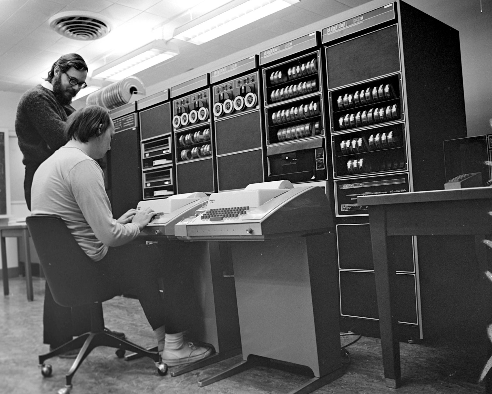
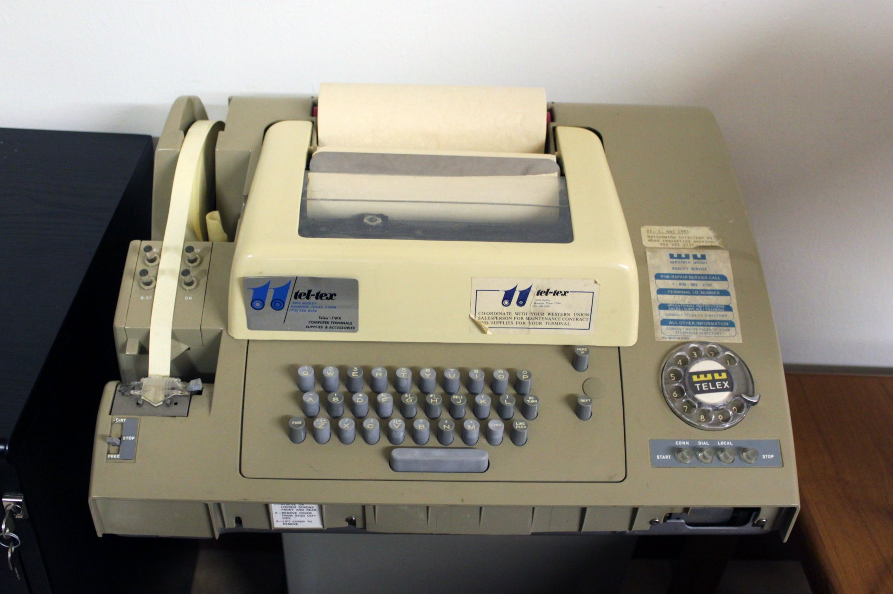
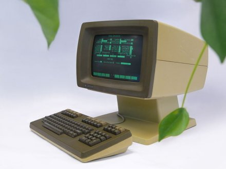
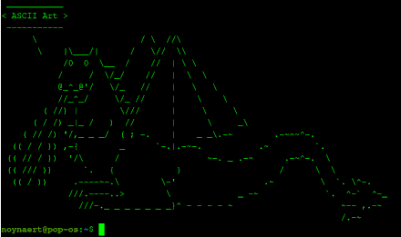
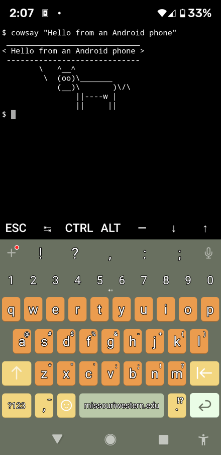

# Unit 00.10 Overview

# Unix and Linux

Unix was developed in the early 1970s.  At some times you had to pay for Unix, but at other times
it was free.  It's complicated.

MS-DOS and Windows were heavily influence by Unix.  In fact, some of the commands are identical in the Windows terminal and in Unix.

Mac OS is actually a version of Unix.  

There were lots of legal battles in the 1990 about who owned Unix and its source code.  BSD Unix seems to be the main form of Unix that has much importance.  BSD has more appeal in commercial applications.

A strong effort is made to keep Linux and BSD synced.  

| Linus Torvalds|Linux|
---|---
||Linus Torvalds released the first version of Linux in 1994.  Technically, he developed the Linux ***kernel***. linux is "open source software" under the GNU software license.   |

## Unix is an operating system like Windows.  

* Operating System is the "software that controls the software"
* OS takes over during bootup
* OS launches other programs and cleans up afterward
* OS provides services like access to printers and files on the disk
* OS provides security services

## Very, very brief history that still effects us now

Ken Thompson and Dennis Ritchie, developers of original Unix | A teletype
-----------------------|-----------
 | 

CRT terminals were not available at that time.  Teletypes were the most common interface.  The use of teletypes had a couple of implications for us today:

* The only interface was text-based.
* [Parsimonious](https://www.merriam-webster.com/dictionary/parsimonious) input.  
  * It was relatively slow to type on, so short commands are favored.
  Not much memory or storage.  Every byte counted.  (They used pure ASCII, so 1 character meant equaled 1 byte)
* Parsimonious output.  
  * Don't waste paper and cause scrolling by printing anything that is not immediately useful.
  * Make provisions to get additional information on-demand (with parsimonious typing, of course)
* Very few special characters on the keyboard.  Also, no arrows or movement commands.
* 80 column width
  * 80 columns was inherited from an older technology known as [punched cards](https://upload.wikimedia.org/wikipedia/commons/f/f3/Punched_card.jpg) had 80 columns.  We typed them on [card punch machines](https://www.youtube.com/watch?v=YnnGbcM-H8c)  (I spent many hours at an IBM Model 29 keypunch when I was a student.  Being able to use a keypunch machine got me my first computer job).

  ### Dumb Terminals

  
  
  Dumb Terminals replaced the teletype.  This was the model used on our campus until about 1990.
 
* No CPU.  They were just a keyboard and monitor that connected to a remote computer.
* Still not fun to type on, but better typing than teletype
* No cost of paper, but only 24 or 25 lines.  So parsimonious output is still important.
* No color.  Either green on black or orange on black.
* No Graphics other than ASCII Graphics.
  
  

# Unix Shell

The shell is what we type commands into.  It is a program that takes input from the keyboard, passes it to the *kernel* and displays the output to the screen.  The shell is the interface between the user and the operating system.

Historically there have been different shells that were used.

* ***sh*** was the original shell
* ***Bourne*** added a lot of advance features.  It was licensed and a closed source program.
* ***Bash*** The "Bourne Again SHell" is an open-source version of the Bourne shell.  It adds some features and has been optimized to run in terminal emulators.  It has provisions for color.  Bash runs on most modern Unix systems, including linux.
  * 
# Linux

* Linux is a version of Unix
* Runs on many devices
  * Supercomputers
  * Mainframes
  * Desktops and Laptops
  * Android phones and Chromebooks
  * IoT and small devices
* Released under the GNU open-source license
* Linux is actually just the ***kernel*** or core program that is the Operating System
* Android phones and Chromebooks use the Linux kernel
  * Therefore they are technically Linux
  * They have an entirely different shell (Interface) but they are still Linux.
    * There is an experimental way to load Bash on a Chromebook.
    * You can load bash on your Android, even without Rooting your phone
  
## This Semester

* Most of this semester we will focus on Bash.
* The focus will be Linux-centric.  However, you can also apply it to other Unix-type systems such as Mac.  Much of the material will apply to Bash running on those systems.
* You will *not* need to run Linux on your own computer until late in the semester.
  * You are welcome to do so, however.
    * Use an old computer.
    * Dual Boot (higher risk).
    * Rapberry Pi or something similar.
    * WSL2 under Windows 10

## Further reading (optional)

For those who are interested or bored, here is some additional material.  This is optional.  It will not appear on quizzes or exams.

* [Differences between Unix and Linux](https://www.howtogeek.com/679989/what-are-the-differences-between-linux-and-unix/) This also has a relatively brief history of Linux and Unix.