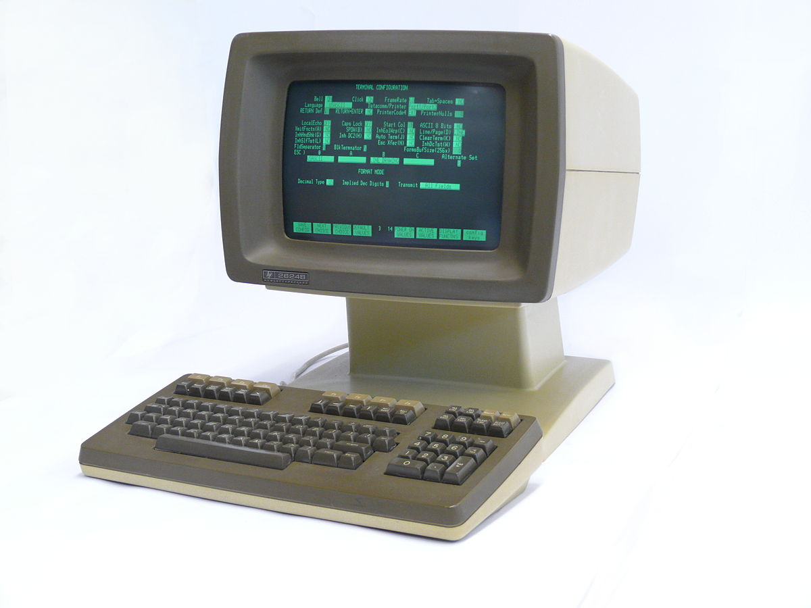

# Unit 01

## ***Connecting, Commands, Man Pages, and Passwords***

Pro tip: *I suggest that you print out these sheets and take notes on them.*

Parental Warning:  Some of the cowfiles may be NSFW.  The ones I am using in examples are SFW.  If you go exploring be over 18 and be prepared for possible objectionable images.

## Choices

A Unix or Linux course can be taught several ways

* Students use computers in an on-campus lab
* Log into a remote system
* Students use Raspberry Pi systems
* Students use virtual machines
* Students dual boot their laptops or use recycled laptops
* Use a cloud system

## Our working environment for the first part of the course

### Motivations

In the first part of the semester we will be connecting to the same server.  
There are several reasons for this:

* Easier setup for students at the start of class
* Everyone is working in the same environment
* Students may use the server for other classes
* The environment is less likely to be damaged by a sudo accident.
* Remote server is a realistic working scenario
* We can have some fun.

### turing.cs.missouriwestern.edu 

## Connecting

* For Windows 10 (late versions)
  * open cmd, PowerShell, bash, or Windows Terminal
* For older Windows systems, use Putty (instructions elsewhere)
  * Even Windows 10 users might want to use putty.
* For Linux or Macs
  * Open a terminal window
  
Terms that mean about the same thing:  terminal window, console window, command
 window, CLI

### Login Id and password

Your login should be the same as your Missouri Western goldlink login id.

Your password will be provided by your instructor

In the following example, the userid is *abyron* but yours will be different

Type the following into your console or terminal:

```bash
$ ssh abyron@turing.cs.missouriwestern.edu
```

ssh lets us emulate a "dumb terminal."

If you had taken programming classes at MWSC (not "U") in the late 1980 or 1990s you would have done your homework on one of these. 
